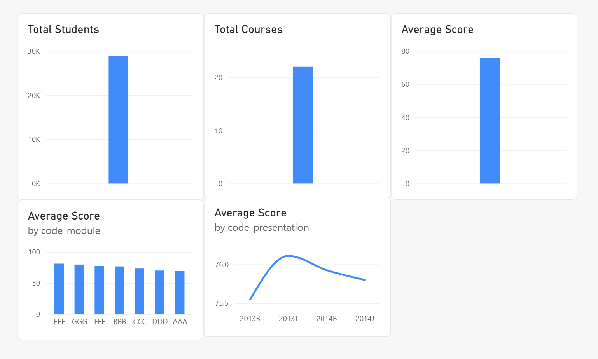

# End-to-end test

Generated by `src/generate_end_to_end_test_report.py` on 2026-09-06 18:30, running the real pipeline against the data currently in `data/raw/`. All rows except Dashboard are computed automatically -- Dashboard requires a manual check in Power BI.

| Test | Expected | Actual | Status |
|---|---|---|---|
| Extraction | Data loaded | 239,326 total records extracted across 5 files | Pass |
| Validation | Invalid records detected | Detected: students.duplicate id_student: 3808; results.missing score: 173 | Pass |
| Database | Records loaded | 235,345 records loaded across 5 tables | Pass |
| Analytics | Query executes | total_students=28785, overall_avg_score=75.8 | Pass |
| Dashboard | Data displayed | I | Pass |
